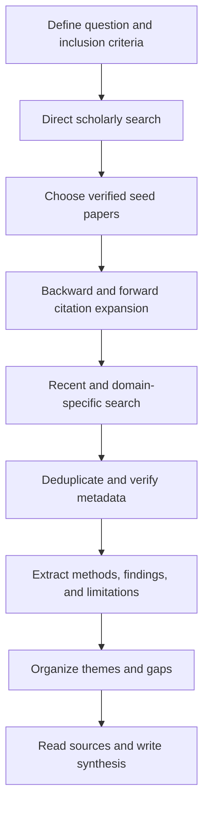

```mermaid
flowchart LR
    A[Generate or collect text] --> B[Inventory references]
    B --> C[Select audit sample]
    C --> D[Verify publication and metadata]
    D --> E[Check DOI / arXiv / PMID]
    E --> F[Map each claim to its citation]
    F --> G[Judge full, partial, or no support]
    G --> H[Record limitations and evidence location]
    H --> I[Report authenticity and support separately]
```

# Benchmarking Factual Accuracy of Large Language Models Across Scientific Domains
​
[](https://awesome.re)
[](LICENSE)
[](#overview)
[](#resource-explorer)
​
A curated resource repository of **papers, benchmarks, datasets, tools, implementations, review materials, citation-audit evidence, and reproducible writing artifacts** for evaluating and improving factual accuracy in scientific Large Language Models (LLMs).
​
> **Scope:** scientific question answering, claim verification, hallucination detection, long-form factuality, evidence attribution, retrieval augmentation, multilingual evaluation, temporal freshness, and expert scientific reasoning.
​
## Contents
​
- [Overview](#overview)
- [Start here](#start-here)
- [Repository collections](#repository-collections)
- [Uploaded artifacts](#uploaded-artifacts)
- [Benchmark landscape](#benchmark-landscape)
- [Evaluation dimensions](#evaluation-dimensions)
- [Resource explorer](#resource-explorer)
- [Visual overview](#visual-overview)
- [Recommended evaluation protocol](#recommended-evaluation-protocol)
- [Citation-integrity workflow](#citation-integrity-workflow)
- [Literature-discovery workflow](#literature-discovery-workflow)
- [LaTeX and reproducibility resources](#latex-and-reproducibility-resources)
- [Repository structure](#repository-structure)
- [Contributing](#contributing)
- [Reference checklist](#reference-checklist)
- [License](#license)
​
## Overview
​
Scientific LLM evaluation requires more than measuring whether an answer sounds plausible. A response may contain a correct final answer but unsupported reasoning, an irrelevant citation, a wrong numerical value, or outdated evidence. The resources in this repository therefore separate:
​
- **answer correctness** from **reasoning validity**;
- **publication authenticity** from **claim–citation support**;
- **closed-book knowledge** from **retrieval-grounded performance**;
- **short-answer accuracy** from **long-form atomic factuality**;
- **static benchmark performance** from **temporal freshness**; and
- **general capability** from **domain-specific scientific risk**.
​
The central idea is to report a **factuality profile**, not just one aggregate score.
​
## Start here
​
Choose the evaluation problem closest to your use case:
​
| If you want to evaluate… | Start with | Why |
|---|---|---|
| Scientific claim verification | [SciFact](https://doi.org/10.18653/v1/2020.emnlp-main.609) | Links claims to abstract-level evidence and support/refute labels |
| Biomedical research QA | [PubMedQA](https://doi.org/10.18653/v1/D19-1259) | Uses biomedical questions derived from PubMed abstracts |
| Truthfulness under common misconceptions | [TruthfulQA](https://doi.org/10.18653/v1/2022.acl-long.229) | Tests whether models reproduce widely repeated false beliefs |
| Large-scale hallucination recognition | [HaluEval](https://doi.org/10.18653/v1/2023.emnlp-main.397) | Provides generated and human-annotated hallucination examples |
| Long-form factual precision | [FActScore](https://arxiv.org/abs/2305.14251) | Decomposes responses into atomic facts |
| Black-box hallucination screening | [SelfCheckGPT](https://arxiv.org/abs/2303.08896) | Uses consistency across sampled generations |
| Current or changing knowledge | [FreshLLMs](https://doi.org/10.18653/v1/2024.findings-acl.813) | Evaluates search augmentation, freshness, and false premises |
| Multilingual factuality | [Multi-FAct](https://arxiv.org/abs/2402.18045) | Extends atomic factuality analysis across languages |
| Graduate-level science reasoning | [GPQA](https://arxiv.org/abs/2311.12022) | Covers expert biology, physics, and chemistry questions |
| Medical hallucination risk | [Med-HALT](https://arxiv.org/abs/2307.15343) | Focuses on medical reasoning and memory-based hallucination |
| Tool-assisted verification | [FacTool](https://arxiv.org/abs/2307.13528) | Uses external tools to verify decomposed claims |
| Source-grounded summarization | [QAGS](https://doi.org/10.18653/v1/2020.acl-main.671) | Evaluates factual consistency through generated questions |
​
## Repository collections
​
| Collection | Description | Open |
|---|---|---|
| Research paper | Introductory review of scientific-LLM factuality | [PDF](paper/AI_Assisted_Research_Paper.pdf) |
| Citation-integrity audit | Reference-authenticity and claim-support audit | [PDF](citation-audit/Citation_Integrity_Audit.pdf.pdf) |
| Citation verification and mapping | Claim-level verification workbook and citation-network evidence | [Folder](citation%20mapping/) |
| Literature-review package | Comparative review and structured 20-paper workbook | [Folder](AI-assisted%20Literature%20Review%20Writing/) |
| Prism and LaTeX package | Conversion evidence, prompts, error log, reflection, and source | [Folder](Scientific%20Writing%20Using%20Prism%20and%20LaTeX/) |
| ACM-style review project | Expanded review paper, figures, LaTeX, and BibTeX | [Folder](Review%20Paper%20Writing%20and%20Formatting%20Using%20LaTeX%20and%20Overleaf/) |
| Dataset guide | Shortlist of verified datasets and benchmarks | [Guide](datasets/datasets.md) |
| Tool guide | Factuality and RAG evaluation tools | [Guide](tools/tools.md) |
| Implementations | Official and useful GitHub repositories | [Guide](implementations/github-repositories.md) |
| Verified references | Organized bibliography with persistent links | [Guide](references/references.md) |
​
## Uploaded artifacts
​
<details>
<summary><strong>Research paper and citation audit</strong></summary>
​
- [AI-assisted research paper](paper/AI_Assisted_Research_Paper.pdf)
- [Citation-integrity audit](citation-audit/Citation_Integrity_Audit.pdf.pdf)
​
</details>
​
<details>
<summary><strong>Citation verification and mapping</strong></summary>
​
- [Citation-mapping report](citation%20mapping/citation%20mapping.pdf)
- [Citation-verification workbook and mapping files](citation%20mapping/)
​
The workbook contains 10 records with principal claims, supporting evidence, evidence locations, support classifications, limitations, and related-paper links.
​
</details>
​
<details>
<summary><strong>Literature-review package</strong></summary>
​
- [Literature-review PDF](AI-assisted%20Literature%20Review%20Writing/ai%20assited%20litrature%20review%20writing.pdf)
- [Structured 20-paper workbook](AI-assisted%20Literature%20Review%20Writing/LiteratureList_T1.xlsx)
​
The workbook includes literature records, tool contributions, ratings, comparison questions, prompts, review-output comparisons, workflow documentation, and a submission checklist.
​
</details>
​
<details>
<summary><strong>Prism and LaTeX conversion package</strong></summary>
​
- [Original paper](Scientific%20Writing%20Using%20Prism%20and%20LaTeX/Original_Paper.pdf)
- [Prism output](Scientific%20Writing%20Using%20Prism%20and%20LaTeX/Prism_Final_Paper.pdf)
- [Overleaf output](Scientific%20Writing%20Using%20Prism%20and%20LaTeX/Overleaf_Final_Paper.pdf)
- [LaTeX source](Scientific%20Writing%20Using%20Prism%20and%20LaTeX/main.tex)
- [BibTeX bibliography](Scientific%20Writing%20Using%20Prism%20and%20LaTeX/references.bib)
- [Prompt log](Scientific%20Writing%20Using%20Prism%20and%20LaTeX/Prompt_Log.pdf)
- [Error log](Scientific%20Writing%20Using%20Prism%20and%20LaTeX/Error_Log.pdf)
- [Paragraph comparison](Scientific%20Writing%20Using%20Prism%20and%20LaTeX/Paragraph_Comparison.pdf)
- [Reflection](Scientific%20Writing%20Using%20Prism%20and%20LaTeX/Reflection.pdf)
- [Submission checklist](Scientific%20Writing%20Using%20Prism%20and%20LaTeX/Submission_Checklist.pdf)
- [Prompt and validation screenshots](Scientific%20Writing%20Using%20Prism%20and%20LaTeX/figure/)
​
</details>
​
<details>
<summary><strong>Final ACM-style review project</strong></summary>
​
- [Compiled review paper](Review%20Paper%20Writing%20and%20Formatting%20Using%20LaTeX%20and%20Overleaf/benchmarking_factual_accuracy_scientific_domains_final.pdf)
- [ACM LaTeX source](Review%20Paper%20Writing%20and%20Formatting%20Using%20LaTeX%20and%20Overleaf/main.tex)
- [BibTeX bibliography](Review%20Paper%20Writing%20and%20Formatting%20Using%20LaTeX%20and%20Overleaf/references.bib)
- [Benchmark taxonomy figure](Review%20Paper%20Writing%20and%20Formatting%20Using%20LaTeX%20and%20Overleaf/figure/taxonomy.png)
- [Evaluation pipeline figure](Review%20Paper%20Writing%20and%20Formatting%20Using%20LaTeX%20and%20Overleaf/figure/pipeline.png)
- [Project instructions](Review%20Paper%20Writing%20and%20Formatting%20Using%20LaTeX%20and%20Overleaf/README.md)
​
</details>
​
## Benchmark landscape
​
| Resource | Year | Domain | Task | Evidence setting | Main output |
|---|---:|---|---|---|---|
| [PubMedQA](https://doi.org/10.18653/v1/D19-1259) | 2019 | Biomedical | Research QA | Abstract supplied | Yes / no / maybe |
| [SciFact](https://doi.org/10.18653/v1/2020.emnlp-main.609) | 2020 | Scientific literature | Claim verification | Abstract retrieval | Support / refute + rationale |
| [QAGS](https://doi.org/10.18653/v1/2020.acl-main.671) | 2020 | Summarization | Factual consistency | Source document supplied | QA-based consistency |
| [TruthfulQA](https://doi.org/10.18653/v1/2022.acl-long.229) | 2022 | Open domain | Adversarial truthfulness | Primarily closed-book | Truthful / informative answer |
| [HaluEval](https://doi.org/10.18653/v1/2023.emnlp-main.397) | 2023 | General NLP | Hallucination recognition | Task-dependent | Hallucination classification |
| [SelfCheckGPT](https://arxiv.org/abs/2303.08896) | 2023 | Open domain | Black-box checking | No external database required | Consistency-based score |
| [FActScore](https://arxiv.org/abs/2305.14251) | 2023 | Long-form generation | Atomic factual precision | External knowledge source | Supported atomic-fact ratio |
| [GPQA](https://arxiv.org/abs/2311.12022) | 2023 | Biology, physics, chemistry | Expert QA | Closed-book / controlled | Multiple-choice accuracy |
| [Med-HALT](https://arxiv.org/abs/2307.15343) | 2023 | Medicine | Hallucination and reasoning | Mixed | Task accuracy |
| [FreshLLMs](https://doi.org/10.18653/v1/2024.findings-acl.813) | 2024 | Dynamic knowledge | Freshness and false premises | Search-augmented | Correctness and hallucination |
| [Multi-FAct](https://arxiv.org/abs/2402.18045) | 2024 | Multilingual | Atomic factuality | Language-dependent retrieval | Multilingual factual precision |
​
## Evaluation dimensions
​
Use this checklist when designing a benchmark or comparing model results:
​
| Dimension | Key question | Example measure |
|---|---|---|
| Correctness | Is the final answer correct? | Exact match, expert score |
| Reasoning | Are the intermediate steps valid? | Step-level verification |
| Factual precision | Which generated claims are supported? | Atomic precision |
| Factual coverage | Are important supported facts omitted? | Atomic recall / completeness |
| Evidence entailment | Does each source support its associated claim? | Claim–citation support |
| Retrieval quality | Was decisive evidence retrieved? | Recall@k, context precision |
| Attribution | Are claims linked to the correct sources? | Citation precision and completeness |
| Numerical fidelity | Are values, units, and transformations correct? | Numeric and unit checks |
| Calibration | Does confidence reflect correctness? | ECE, Brier score |
| Abstention | Does the model decline unsupported questions? | Selective accuracy |
| Freshness | Is the answer correct for the evaluation date? | Time-stamped accuracy |
| Robustness | Does performance survive paraphrases and false premises? | Adversarial consistency |
| Safety | What is the consequence of an error? | Domain-specific severity tier |
​
## Resource explorer
​
<details>
<summary><strong>Surveys and conceptual foundations</strong></summary>
​
- [Survey of Hallucination in Natural Language Generation](https://doi.org/10.1145/3571730) — broad taxonomy of hallucination across generation tasks.
- [Siren's Song in the AI Ocean](https://arxiv.org/abs/2309.01219) — survey of causes, detection, and mitigation for hallucinations in LLMs.
- [A Multitask, Multilingual, Multimodal Evaluation of ChatGPT](https://arxiv.org/abs/2302.04023) — broad evidence across tasks, languages, and modalities.
- [Large Language Models Encode Clinical Knowledge](https://doi.org/10.1038/s41586-023-06291-2) — medical QA and human evaluation dimensions.
​
</details>
​
<details>
<summary><strong>Scientific QA and reasoning benchmarks</strong></summary>
​
- [PubMedQA](https://doi.org/10.18653/v1/D19-1259)
- [GPQA](https://arxiv.org/abs/2311.12022)
- [SciBench](https://arxiv.org/abs/2307.10635)
- [ScienceQA](https://arxiv.org/abs/2209.09513)
- [MMLU](https://arxiv.org/abs/2009.03300)
- [Med-HALT](https://arxiv.org/abs/2307.15343)
​
</details>
​
<details>
<summary><strong>Claim verification and factuality metrics</strong></summary>
​
- [SciFact](https://doi.org/10.18653/v1/2020.emnlp-main.609)
- [QAGS](https://doi.org/10.18653/v1/2020.acl-main.671)
- [FActScore](https://arxiv.org/abs/2305.14251)
- [Multi-FAct](https://arxiv.org/abs/2402.18045)
- [Program-Guided Fact-Checking](https://doi.org/10.18653/v1/2023.acl-long.385)
- [FacTool](https://arxiv.org/abs/2307.13528)
​
</details>
​
<details>
<summary><strong>Hallucination and truthfulness evaluation</strong></summary>
​
- [TruthfulQA](https://doi.org/10.18653/v1/2022.acl-long.229)
- [HaluEval](https://doi.org/10.18653/v1/2023.emnlp-main.397)
- [SelfCheckGPT](https://arxiv.org/abs/2303.08896)
- [Med-HALT](https://arxiv.org/abs/2307.15343)
​
</details>
​
<details>
<summary><strong>Retrieval, grounding, and temporal freshness</strong></summary>
​
- [Retrieval-Augmented Generation for Knowledge-Intensive NLP Tasks](https://proceedings.neurips.cc/paper/2020/hash/6b493230205f780e1bc26945df7481e5-Abstract.html)
- [Shall We Pretrain Autoregressive Language Models with Retrieval?](https://doi.org/10.18653/v1/2023.emnlp-main.482)
- [FreshLLMs](https://doi.org/10.18653/v1/2024.findings-acl.813)
​
</details>
​
<details>
<summary><strong>Official implementations and evaluation libraries</strong></summary>
​
- [HaluEval](https://github.com/RUCAIBox/HaluEval)
- [SelfCheckGPT](https://github.com/potsawee/selfcheckgpt)
- [TruthfulQA](https://github.com/sylinrl/TruthfulQA)
- [SciFact](https://github.com/allenai/scifact)
- [FActScore](https://github.com/shmsw25/FActScore)
- [FacTool](https://github.com/GAIR-NLP/factool)
- [TruLens](https://github.com/truera/trulens)
- [Ragas](https://github.com/explodinggradients/ragas)
​
</details>
​
<details>
<summary><strong>Literature discovery and review tools</strong></summary>
​
- [ResearchRabbit](https://www.researchrabbit.ai/) — citation-network exploration.
- [Litmaps](https://www.litmaps.com/) — forward/backward citation mapping and monitoring.
- [Semantic Scholar](https://www.semanticscholar.org/) — scholarly search, metadata, and citation discovery.
- [Elicit](https://elicit.com/) — structured literature comparison and evidence extraction.
- [Crossref](https://search.crossref.org/) — DOI and bibliographic metadata verification.
- [OpenAlex](https://openalex.org/) — open scholarly metadata and research graph.
- [ACL Anthology](https://aclanthology.org/) — official NLP publication records.
- [PubMed](https://pubmed.ncbi.nlm.nih.gov/) — biomedical literature verification.
​
</details>
​
## Visual overview
​
<details open>
<summary><strong>Taxonomy of scientific factuality benchmarks</strong></summary>
​

​
</details>
​
<details>
<summary><strong>Cross-domain evaluation pipeline</strong></summary>
​

​
</details>
​
## Recommended evaluation protocol
​
A practical cross-domain benchmark should combine multiple task and evidence settings.
​
### 1. Run two evidence conditions
​
- **Closed-book:** tests stored knowledge, reasoning, uncertainty, and abstention.
- **Evidence-grounded:** tests retrieval, source selection, synthesis, and attribution.
​
### 2. Cover four task families
​
1. constrained scientific question answering;
2. claim–evidence verification;
3. long-form scientific synthesis; and
4. temporally changing or false-premise questions.
​
### 3. Evaluate at several levels
​
- final answer;
- reasoning steps;
- atomic claims;
- evidence and citations;
- numerical values and units;
- confidence and abstention; and
- potential scientific harm.
​
### 4. Preserve reproducibility
​
Record:
​
- model and version;
- prompt and decoding settings;
- evaluation date;
- retrieval query and index;
- evidence snapshot;
- scoring implementation;
- judge model, if used; and
- raw outputs and expert adjudication notes.
​
### 5. Report disaggregated results
​
Publish results by domain, task, evidence condition, language, error type, and risk tier before presenting any macro-average.
​
## Citation-integrity workflow
​

​
### Minimum verification fields
​
- publication found;
- title match;
- author match;
- year and venue match;
- identifier match;
- claim supported, partially supported, contradicted, or not addressed;
- page, section, table, or figure containing the evidence; and
- source limitation.
​
## Literature-discovery workflow
​

​
**Suggested tool sequence**
​
1. Semantic Scholar or OpenAlex for the initial set.
2. ResearchRabbit and Litmaps for network expansion.
3. Semantic Scholar with year and domain filters for recent work.
4. Elicit for structured comparison.
5. Crossref, publisher records, ACL Anthology, arXiv, or PubMed for verification.
6. Human reading for final inclusion, interpretation, and writing.
​
## LaTeX and reproducibility resources
​
Two source projects are included:
​
### Prism conversion package
​
[Open folder](Scientific%20Writing%20Using%20Prism%20and%20LaTeX/)
​
Contains the original paper, Prism and Overleaf outputs, `main.tex`, `references.bib`, prompt evidence, error documentation, paragraph comparison, reflection, checklist, and screenshots.
​
### ACM-style review package
​
[Open folder](Review%20Paper%20Writing%20and%20Formatting%20Using%20LaTeX%20and%20Overleaf/)
​
Contains an expanded review manuscript, bibliography, taxonomy figure, evaluation-pipeline figure, compiled PDF, and build instructions.
​
### Standard build sequence
​
```bash
pdflatex main.tex
bibtex main
pdflatex main.tex
pdflatex main.tex
```
​
When using Overleaf, upload `main.tex`, `references.bib`, and the complete `figure/` folder.
​
> **Build note:** the uploaded ACM source currently references `figures/taxonomy.png` and `figures/pipeline.png`, while the repository directory is named `figure/`. Before compiling, either rename `figure/` to `figures/` or change those two paths in `main.tex` to `figure/taxonomy.png` and `figure/pipeline.png`.
​
## Repository structure
​
```text
.
├── README.md
├── paper/
├── citation-audit/
├── citation mapping/
├── AI-assisted Literature Review Writing/
├── Scientific Writing Using Prism and LaTeX/
├── Review Paper Writing and Formatting Using LaTeX and Overleaf/
├── datasets/
├── implementations/
├── references/
├── tools/
└── LICENSE
```
​
## Contributing
​
Contributions are welcome for:
​
- new scientific factuality benchmarks;
- domain-specific datasets;
- evaluation metrics and implementations;
- multilingual resources;
- dynamic or contamination-resistant benchmarks;
- citation-verification tools; and
- reproducibility guides.
​
### Add a resource
​
1. Confirm that the publication or project exists.
2. Prefer a DOI, official publisher page, arXiv record, or official repository.
3. Add it to the most relevant Markdown file.
4. Use the entry template below.
5. Check that every link works.
6. Open a pull request with a concise explanation.
​
```markdown
- **Resource name** — one-sentence description.
  - **Persistent link:** `DOI, arXiv, publisher, or official repository URL`
  - **Task:** claim verification / QA / long-form factuality / retrieval / other
  - **Domain:** biomedical / physics / chemistry / multidisciplinary / other
  - **Evidence:** closed-book / supplied context / retrieval / tools
  - **Code or data:** official-link
  - **Limitation:** one concise limitation
```
​
## Reference checklist
​
Before merging a new citation:
​
- [ ] The publication exists.
- [ ] The title and authors match the official record.
- [ ] The year and venue are correct.
- [ ] The DOI, arXiv ID, PMID, or URL resolves correctly.
- [ ] The linked source supports the description.
- [ ] The resource is placed in the correct category.
- [ ] The description distinguishes findings from limitations.
- [ ] The entry does not duplicate an existing resource.
​
## License
​
This repository is available under the [MIT License](LICENSE).
​
